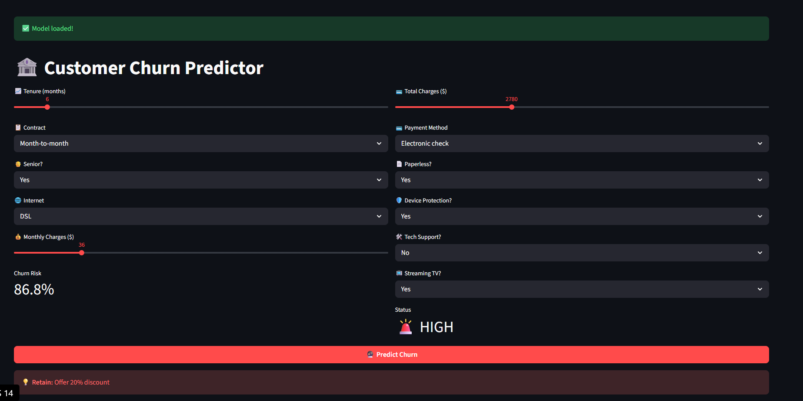
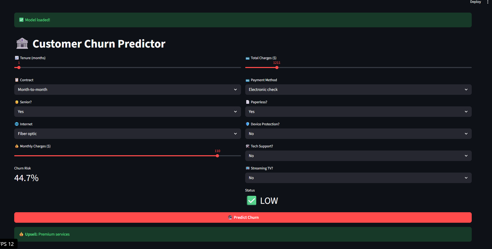

# 🚀 Customer Churn Prediction App

End-to-end ML project predicting **telecom customer churn** using Logistic Regression (**F1 = 0.61**).

🔗 **Live Demo:** https://churn-prediction-app1.onrender.com  

[](https://churn-prediction-app1.onrender.com)

---

## 📊 Model Performance

| Model                | Accuracy | F1‑Score | Recall |
|----------------------|----------|----------|--------|
| Logistic Regression  | **80.1%** | **61.0%** | **58.6%** |
| Random Forest        | 78.6%    | 54.6%    | 48.4% |
| Decision Tree        | 76.8%    | 52.9%    | 49.2% |

---

## ✨ Key Features

- Uses **21 telecom features** such as tenure, contract type, monthly/total charges, and subscribed services.[file:89]  
- Full **scikit‑learn preprocessing pipeline** (encoding + scaling) wrapped with the model for safe deployment.[file:89]  
- **Streamlit web app** for instant churn risk predictions with a simple, business-friendly UI.  
- Shows **churn probability** and a clear **risk label** (Low / High) for each customer.  
- Includes space for **business recommendations** like discounts, retention calls, or cross‑sell offers.[file:89]  

---

## 📱 Screenshots

### Low‑Risk Customer (click to open app)  
[](https://churn-prediction-app1.onrender.com)

### High‑Risk Customer (click to open app)  
[](https://churn-prediction-app1.onrender.com)

---

## 🛠️ Tech Stack

- **Language & Libraries:** Python, pandas, numpy, scikit‑learn, joblib, plotly  
- **ML:** Logistic Regression (plus Random Forest and Decision Tree baselines)  
- **App Framework:** Streamlit  
- **Deployment:** Render Web Service (Python 3.11, `pip install -r requirements.txt`)[web:113]  

---

## 🚀 Quick Start (Run Locally)

```bash
# Clone the repo
git clone https://github.com/VEERA16-16/churn-prediction-app.git
cd churn-prediction-app

# (Optional) create and activate virtual environment
python -m venv .venv
# Windows:
.venv\Scripts\activate
# Linux / macOS:
source .venv/bin/activate

# Install dependencies
pip install -r requirements.txt

# Run the Streamlit app
streamlit run app.py


### Model Overview

The app uses the IBM Telco Customer Churn dataset (7,043 customers) to predict whether a customer will churn in the next period. The final model is a Logistic Regression pipeline built with scikit‑learn:

- Numeric features (`tenure`, `MonthlyCharges`, `TotalCharges`) are standardized.
- Categorical features (e.g., `gender`, `Contract`, `InternetService`, `PaymentMethod`) are one‑hot encoded with `handle_unknown="ignore"`.
- Train/test split: 80/20 with stratification on the churn label.
- Test performance:
  - ROC‑AUC: **0.842**
  - Recall (churn class, threshold = 0.50): **0.463**

In the Streamlit app, customers with predicted churn probability above 50% are labeled **High Risk** and flagged for retention actions.
