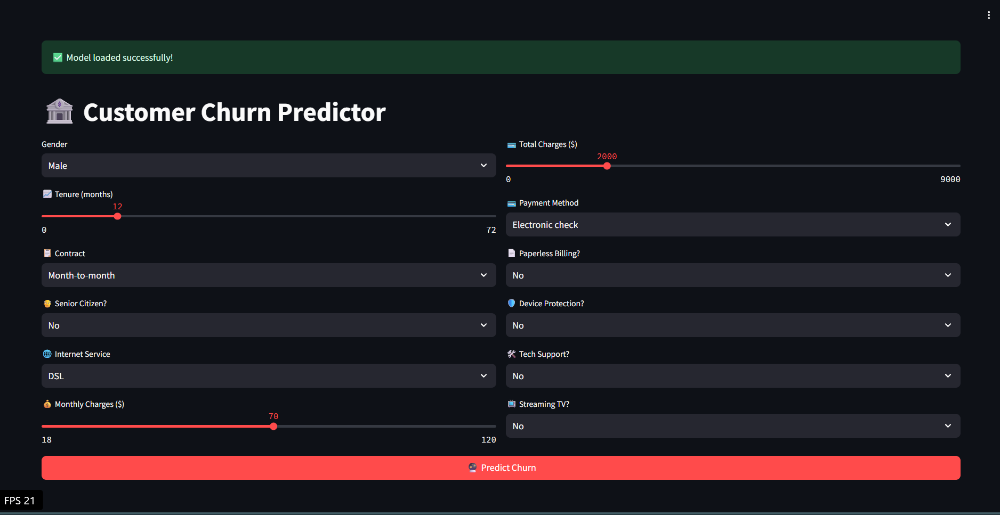
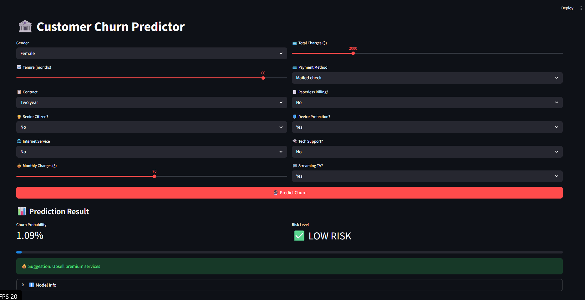
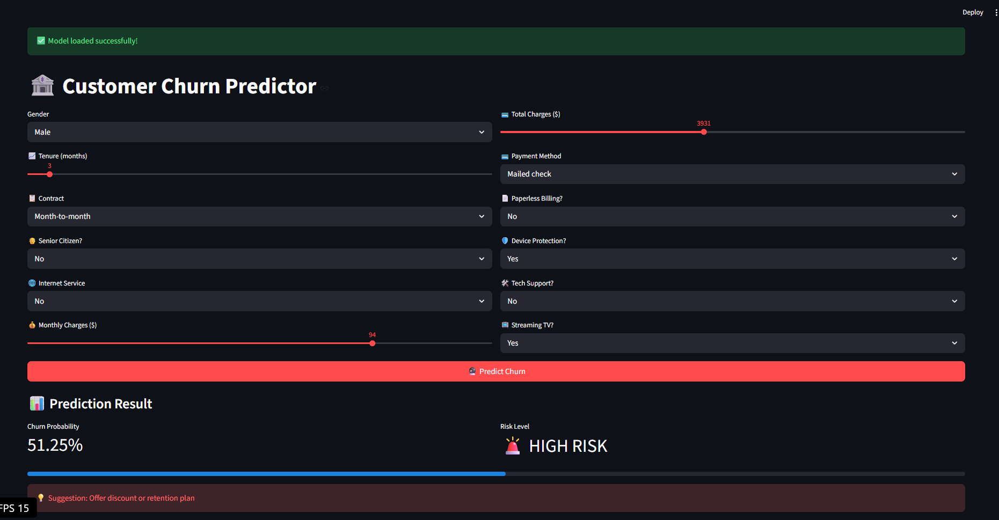
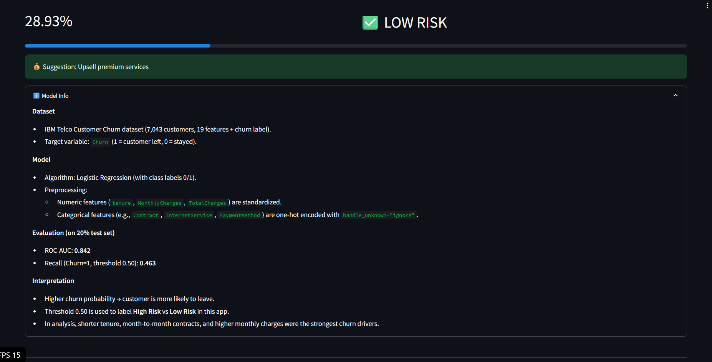

# 🏦 Telecom Customer Churn Prediction (Streamlit App)

Predict telecom customer churn risk using a Logistic Regression model with a complete ML pipeline, deployed as an interactive Streamlit web app.

[](https://your-render-app-url.onrender.com)
[](README.md)
[](https://www.python.org/downloads/)

## 📊 Dataset

**IBM Telco Customer Churn Dataset** (7,043 customers, 21 columns):

| Category | Features |
|----------|----------|
| **Demographics** | Gender, Senior Citizen, Partner, Dependents |
| **Account Info** | Tenure (months), Contract, Monthly/Total Charges |
| **Services** | Phone Service, Internet Service, Tech Support, Streaming TV |
| **Billing** | Paperless Billing, Payment Method |

**Target**: `Churn` (1 = customer left, 0 = stayed) [web:308]

## 🧠 Approach


1. **EDA**: Analyzed distributions, correlations, and churn patterns.
2. **Preprocessing**: 
   - Numeric scaling (`tenure`, `MonthlyCharges`, `TotalCharges`).
   - One-hot encoding for categoricals with `handle_unknown="ignore"`.
3. **Models**: Compared Logistic Regression vs Random Forest; selected Logistic Regression.
4. **Pipeline**: Saved as `churn_pipeline.joblib` for production use.

## 📈 Model Performance

**Test set (20% holdout)**:

| Metric | Value |
|--------|-------|
| ROC‑AUC | **0.842** |
| Precision (Churn=1) | 0.652 |
| Recall (Churn=1) | **0.463** |
| F1‑Score | 0.534 |

**Key Insights** (from feature analysis):
1. **Short tenure** → highest churn risk.
2. **Month‑to‑month contracts** → 3x higher risk vs two‑year.
3. **High monthly charges** + **Fiber optic** → risky combination [web:292][web:293]

## 🚀 Streamlit App Demo

### Features
- Interactive sliders/dropdowns for all customer features.
- Live churn probability + risk label.
- Business suggestions (retention vs upsell).
- Model info and interpretation.

## 📸 Screenshots

### Home page


### Low‑risk churn prediction


### High‑risk churn prediction


### Model info section


### Live Demo
🟢 **App**: [https://churn-prediction-app-5psk.onrender.com]
📓 **Notebook**: [Untitled.ipynb](Untitled.ipynb)


### Run Locally
```bash
# Clone repo
git clone https://github.com/yourusername/telco-churn-prediction-streamlit.git
cd telco-churn-prediction-streamlit

# Install dependencies
pip install -r requirements.txt

# Run app
streamlit run app.py
